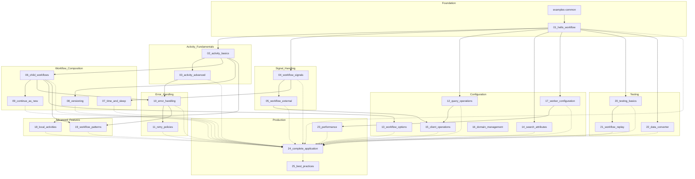

# Cadence Examples Dependency Graph

## Visual Dependency Diagram



## Linear Implementation Order

```
examples-common (foundation)
    ↓
01_hello_workflow ─┬─→ 02_activity_basics ──→ 03_activity_advanced ──┐
    │                │                                              │
    │                ├─→ 04_workflow_signals ──→ 05_workflow_external │
    │                │                                              │
    │                ├─→ 06_child_workflows ──→ 09_continue_as_new   │
    │                │                                              │
    │                ├─→ 07_time_and_sleep                          │
    │                │                                              │
    │                └─→ 08_versioning ─────────────────────────────┤
    │                                                               │
    ├─→ 12_query_operations ──→ 15_client_operations ←──────────────┤
    │                    ↑                                          │
    ├─→ 14_search_attributes                                        │
    │                                                               │
    └─→ 17_worker_configuration ──→ 23_performance                  │
                                                                   │
03_activity_advanced ──→ 10_error_handling ──→ 11_retry_policies  │
06_child_workflows ────→───────────────────────────────────────────┤
                                                                   │
02_activity_basics ──→ 18_local_activities                         │
06_child_workflows ─┬─→ 19_workflow_patterns ←────────────────────┤
10_error_handling ──┘                                             │
                                                                   │
01_hello_workflow ──→ 20_testing_basics ──→ 21_workflow_replay    │
                                                                   │
16_domain_management (standalone)                                  │
                                                                   │
All examples ─────────────────────────────────────────────────→ 24_complete_application
                                                                   ↓
                                                              25_best_practices
```

## Phase-Based Implementation

### Phase 1: Foundations (Weeks 1-2)
```
examples-common
01_hello_workflow
02_activity_basics
03_activity_advanced
```

### Phase 2: Workflow Core (Weeks 3-4)
```
04_workflow_signals
05_workflow_external
06_child_workflows
07_time_and_sleep
08_versioning
09_continue_as_new
```

### Phase 3: Error Handling (Week 5)
```
10_error_handling
11_retry_policies
```

### Phase 4: Configuration (Weeks 6-7)
```
12_query_operations
13_workflow_options
14_search_attributes
15_client_operations
16_domain_management
17_worker_configuration
```

### Phase 5: Advanced Features (Week 8)
```
18_local_activities
19_workflow_patterns
```

### Phase 6: Testing (Week 9)
```
20_testing_basics
21_workflow_replay
22_data_converter
```

### Phase 7: Production (Week 10)
```
23_performance
24_complete_application
25_best_practices
```

## Critical Path

The critical path (longest chain of dependencies) is:

```
examples-common → 01_hello_workflow → 02_activity_basics → 
03_activity_advanced → 10_error_handling → 11_retry_policies →
24_complete_application → 25_best_practices
```

This path has 8 steps and determines the minimum time needed if working sequentially.

However, many examples can be developed in parallel:

- **Group A**: 01, 04, 12, 14, 16, 17 (can all start immediately)
- **Group B**: 02, 05, 06, 08, 13, 18 (depend on Group A)
- **Group C**: 03, 07, 09, 19, 20, 22 (depend on Group B)
- **Group D**: 10, 21 (depend on Group C)
- **Group E**: 11, 15, 23 (depend on Group D)
- **Group F**: 24, 25 (depend on all previous)

## Feature Group Dependencies

### Activity Features Chain
```
02_activity_basics → 03_activity_advanced → 10_error_handling → 11_retry_policies
```

### Signal Features Chain
```
04_workflow_signals → 05_workflow_external → 15_client_operations
```

### Workflow Composition Chain
```
02_activity_basics → 06_child_workflows → 09_continue_as_new
                     06_child_workflows → 19_workflow_patterns
```

### Testing Chain
```
01_hello_workflow → 20_testing_basics → 21_workflow_replay
```

### Configuration Chain
```
01_hello_workflow → 17_worker_configuration → 23_performance
```

## Standalone Examples

These examples have no dependencies and can be built at any time:
- `16_domain_management` - Domain operations are independent
- `22_data_converter` - Can reference any existing example

## Integration Points

Examples that integrate multiple concepts:

- **05_workflow_external**: Integrates signals + client operations
- **10_error_handling**: Integrates activities + child workflows
- **15_client_operations**: Integrates external signals + queries
- **19_workflow_patterns**: Integrates child workflows + error handling
- **24_complete_application**: Integrates ALL previous examples
